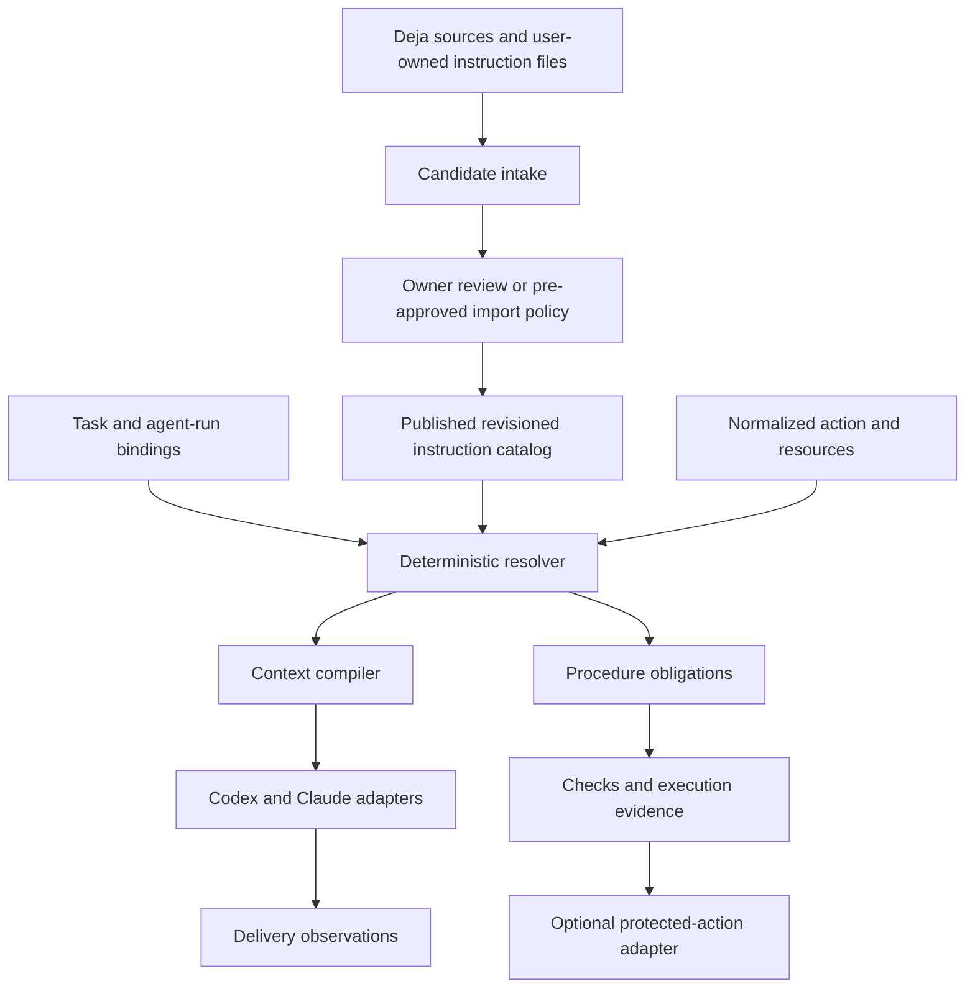

# Cross-agent instruction runtime: design of record

Status: proposed next design, not implemented behavior. Updated: 2026-09-06.
Baseline: `feat/instructions-set` at `a6b760b9039e37d1aaf178beba29b0455c67e142` (PR #1).

This document develops the rest of the local instruction-memory system from the
advisory v0. It does not change that binary, approve any user instructions,
install hooks, select a database, or enable action enforcement.

Read alongside the [v0 usage guide](instruction-memory.md),
[storage decision](instruction-runtime-storage.md), and
[implementation and acceptance plan](instruction-runtime-plan.md).
The v0 guide remains the authority for commands that actually exist.

## 1. Outcome and boundaries

An instruction established once should apply to the right task in either Codex
or Claude Code without the agent having to remember to search for it. Required
skills and runbooks should become visible before the work that needs them.
Permanent requirements must survive compaction and handoffs; temporary ones
must not spread to unrelated work. Every inclusion, omission, exception, and
conflict must be explainable.

Deja remains one application with two responsibilities:

- History recall answers what happened, was attempted, or was discussed.
- Instruction resolution answers what currently applies and what remains due.

The second is not a new ranking boost in the first. Use the existing history
sources, provenance, privacy controls, and agent plumbing; keep the approved
instruction model and deterministic resolver separate. Codegraph and ACR may
supply supporting references later, but neither is a runtime dependency.

Non-goals for this iteration: another conversation index, an autonomous planner,
a general shell-policy interpreter, a distributed database, hosted memory,
or a claim that text injection guarantees obedience. Local storage also does
not mean local-only model processing: delivered text goes to the configured
agent/model provider. No independent network service is required for history.

The scope is design and staged implementation, not a requirement to ship all
components in one PR. Useful advisory delivery should precede optional gates.

## 2. What the branch actually contains

The following inventory is based on the source at the baseline commit.

| Area | Present in v0 | Remaining gap |
| --- | --- | --- |
| `internal/instructions/model.go` | Typed rules, scope, strength, absolute flag, lifetime, exceptions, runbook hash | Named sets, authenticated approval semantics, structured effects, stable identities |
| `resolve.go` | Mandatory accumulation, explicit keyed conflicts, conditional unknowns | Scope containment, compatible defaults, selective candidates, per-action resolution |
| `store.go` | Full JSON snapshot, global compare-and-swap, revision archives, writer lock | Selective reads, transactional task state, crash recovery, retention |
| `render.go` | Complete required text or an error; 8,000-byte packet limit | Context epochs, safe delivery deduplication, staged runbooks, actionable partial states |
| `hook.go` | Four events; Git-root/worktree discovery; single-file tool targets | Child-run identity, actual action/resource mapping, result observation, task binding |
| `install.go` | Opt-in, preserves unrelated hook configuration | Capability probes, ownership-aware uninstall/repair, native guidance reconciliation |
| `cli.go` | Example/apply/export/resolve/hook/install | Candidate inbox, single-rule edits, task operations, procedure status, diagnostics |

Specific design corrections, rather than assertions that these are solved:

1. `specificity` counts nonempty selectors. It does not establish that one scope
   is a subset of another; two overlapping scopes can be incomparable.
2. A mandatory keyed rule currently suppresses all preferences for the key.
   For `must_not backend=remote`, a compatible `should backend=local` should
   remain eligible, not disappear.
3. Unknown task/path/tool scope is rendered as conditional text. Many unrelated
   conditional rules can exhaust the packet. Unknown must stay explicit without
   requiring every potentially relevant procedure body at every lifecycle event.
4. `Store.Load` and `Resolve` both validate, and explanation output carries
   excluded records. Changing a database underneath this full-snapshot interface
   alone does not remove the work proportional to the whole registry.
5. `--approve` and `approved_by` record intent/provenance, not authentication.
   A same-user agent can still edit the files/checker. No adversarial isolation
   has been implemented.
6. Task identity is an explicit string, with no task-closure state. Session
   identity does not namespace the harness or identify a child run. Rendering
   a procedure records neither delivery acknowledgement nor completion.

These are bounded follow-ups to the first pass, not reasons to replace Deja.

## 3. Components and data ownership

The catalog is authoritative for approved instructions. Draft Markdown/JSON
files are authoring inputs until published; generated AGENTS/CLAUDE fragments
are projections. The runtime store is authoritative for task/obligation state.
Historical analytics and cached projections are rebuildable and never grant
permission. There must not be two independently editable copies of one rule.

Keep the pure resolver in `internal/instructions`. Add small modules for
catalog/publication, intake, task state, procedures, delivery, and adapters as
those responsibilities become real. Avoid a generic plugin framework initially.
The existing `internal/policy` history privacy policy is not renamed or silently
reused as an action-enforcement engine.

For the stateful multi-agent phase, use one profile-local writer in the Deja
binary, with a private local IPC endpoint and an in-memory scoped read model.
It can be launched on demand by an explicitly enabled integration; it is not
another application or a requirement to run ACR. See the storage decision for
why this topology keeps both SQLite and DuckDB eligible. V0 remains usable
without this process. A future offline mode is read-only and must report when
it cannot establish current task or approval state; it is not a second writer.

## 4. Records and identities

### 4.1 Instruction sets and rule revisions

An `InstructionSet` groups rules, not their evidence-ranking scores. Examples
are a personal baseline, a repository workflow, and release procedures. A set
has a stable ID, owner, revision, activation scope, and explicit inclusion list.
A published bundle pins every included set/rule/procedure revision. Inclusion
cycles and missing references fail publication. No floating `latest` dependency
is permitted in a published bundle.

Set scope intersects rule scope. Set validity also restricts rule validity;
a child cannot broaden its parent's scope or outlive a task-bound parent.
Set membership and revisions are part of the catalog generation. Disabling a
set containing protected requirements is a policy change, not a preference
that an ordinary agent can quietly toggle.

A `RuleRevision` contains these separate dimensions:

| Dimension | Contract |
| --- | --- |
| Identity | Namespaced rule ID, immutable revision, payload digest |
| Meaning | Kind, original wording, approved operative text, optional rationale |
| Authority | Principal and delegation reference; source is not authority |
| Requirement | Required, prohibited, or preferred |
| Override | Explicit exception, authorized scoped override, or no exception without revising the rule |
| Scope | Conjunction of supported typed selectors |
| Activation | Lifecycle phases and/or action/resource predicates |
| Lifetime | Persistent, task-bound, run-bound, or explicit interval |
| Effect | Optional structured effect with key, operator, and value |
| Provenance | Source identity, exact span/reference, content digest, extraction version |
| State | Candidate, active revision, superseded, revoked, or quarantined |

Expiration is computed from validity, not dependent on a cleanup job. A review
reminder does not expire a persistent rule. Numerical priority only orders
otherwise eligible guidance or explicitly resolves equally scoped defaults.
It never turns a requirement into a preference or waives a prohibition.

For v2, replace the ambiguous `absolute` Boolean with an explicit override
contract. Preserve the v0 meaning during migration: an absolute needs an owner
exception naming its revision. The optional stronger mode disallows exceptions
until the owner revises/revokes the rule. Neither mode overrides platform or
managed instructions. Persistent and absolute remain independent properties.

A rule should express one obligation. Compound prose may remain verbatim, but
partial exceptions require splitting it into separately approved rule IDs;
do not infer which half of a paragraph the owner intended to waive.

### 4.2 Repository, checkout, task, and run identity

Repository identity must survive a directory move but must not be borrowed from
an untrusted repository-provided UUID. Maintain a local owner-controlled
mapping of repository IDs to approved Git-common-directory identities. A
remote URL is a discovery hint, not proof that a new clone inherits private
rules. Aliasing additional clones requires explicit mapping. Strip credentials
from origin references. Keep checkout/worktree IDs separate from repository IDs.

A `Task` uses an opaque non-recycled ID plus an optional external reference.
An issue number or branch name is a label, not the primary ID. One task can have
several runs and checkouts. A run records profile, harness, native session ID,
child-agent ID where available, incarnation, and parent-run ID. Parent/native
session ID alone is not sufficient to identify all child contexts.

A run-to-task binding is explicit, revisioned, and recoverable. At first use an
adapter can create a session-local task automatically. Cross-agent handoff
attaches to the exported task ID rather than guessing from prompt similarity.
Two concurrent sessions in one worktree must not silently share an active task.
Where child identity is unavailable, report reduced isolation and do not share
its delivery-dedup state with the parent.

### 4.3 Remaining records

| Record | Purpose |
| --- | --- |
| `Candidate` | Proposed capture/revision with source and review state |
| `ProcedureRevision` | Approved procedure content, steps, dependencies, check definitions and digests |
| `ExceptionGrant` | Rule revision, approving principal, allowed scope, lifetime and reason |
| `Obligation` | A procedure/requirement instantiated for a task and resource set |
| `EvidenceReceipt` | What was observed, by which observer, against which inputs |
| `DeliveryRecord` | A packet emitted or observed in a particular run/context epoch |
| `AuditEvent` | Idempotent record of a state transition with ordering and provenance |

## 5. Deterministic resolution contract

Resolution takes a catalog generation, task/binding revision, normalized
context, proposed action/resources, and explicit evaluation time. Its result
contains applicable, deferred/unknown, excluded, conflicted and excepted rules,
required procedures, generation identifiers, missing context fields, and
reason codes. Unknown is not success, and not a fabricated match.

### 5.1 Selection

Use exact indexed selectors for profile/set, repository, checkout, task, run,
environment, action kind, and path components. Within a selector an explicit
list means OR; across selectors means AND. Start with this bounded language,
not arbitrary code or model-generated predicates.

Retrieve a conservative superset for deterministic evaluation. Index absence
must never discard global rules, wildcard selectors, or potential matches for
unknown fields. Test the indexed selector against a full-scan oracle. Ordinary
hook packets need only selected records and reason summaries; a paged explain
operation can load all exclusions. Do not copy the whole registry to explain
that most of it was irrelevant.

Evaluate applicability and activation separately. A production deployment rule
need not expand its runbook at startup. Its activation descriptor can be in the
repository's bootstrap guidance; when a deployment is proposed, the precise
requirements must be resolved. A protected deployment with unknown environment
is unresolved and cannot receive a positive gate result. Ordinary read-only
work should not be globally blocked by this missing deployment context.

### 5.2 Effects, conflicts, and defaults

Mandatory rules accumulate. A preference cannot defeat one, regardless of its
recency, frequency, authority label, specificity, or numerical priority.

For initial structured conflicts, support a small setting model: `require
value`, `forbid value`, and `prefer value`. Conflict identity is `(effect
namespace, key, resolved resource)`, so unrelated targets do not conflict.
Two different required values for the same single-valued setting conflict;
requiring a forbidden value conflicts. Multiple forbidden values accumulate.
A preferred value not forbidden by any required constraint stays eligible.
Arbitrary prose contradictions are review candidates, not a claimed capability
of this deterministic setting model.

Among compatible defaults, apply the explicit delegated authority order first.
Within equal authority, scope A is more specific than B only if A is a strict
subset of B in the supported selector language. A deeper path prefix and a
narrower tool list can establish containment; counting fields cannot. Priority
breaks ties only for equivalent scopes in the same authority tier. Different
values under overlapping incomparable scopes remain an unresolved default
conflict unless an approved `overrides` relationship resolves them. Same-value
defaults may coalesce for display while preserving every source ID.

Do not let a preference conflict erase unrelated mandatory context. The result
is structured and action-scoped: report the conflict alongside unaffected
instructions. Only an affected protected action is denied by a gate. In
advisory mode the model gets the conflict and its alternatives, not an invented
winner. Stable IDs provide display order, never semantic tie-breaking.

### 5.3 Revisions and exceptions

A new approved revision supersedes that rule's previous revision. A newer
unrelated message does not. A grant must name the exact rule revision and
narrow its scope; an exception cannot broaden who or what the rule governs.
Bound grants by task and expiry and, when needed, environment, resource and
run. A grant does not flow to subagents unless its inheritance mode explicitly
allows that task subtree. Follow-on tasks receive none by default.

Revoke grants explicitly; do not reuse their IDs. A rule change invalidates
prior grants unless the owner approves new ones. Exception application and the
remaining requirements must be visible in explanations and delivery updates.
Authorization to perform an action is distinct from an exception to a workflow
rule: passing a runbook does not authorize a deployment the user never requested.

### 5.4 Lifetime

Persistent means until approved revision/revocation. Task-bound rules remain
active while the task is open or suspended and apply to its explicitly bound
runs. A process exit, model stop, compaction, handoff, or inactivity timeout does
not complete the task. Task close/cancel ends task-bound applicability; reopen
creates a new task incarnation and does not silently reactivate old exceptions.
Run-bound rules never cross runs without an explicit conversion to task scope.

Use UTC timestamps for durable intervals and explicit inclusive expiry
(`now >= expires_at`). Cache validity ends at the earliest relevant boundary,
including a future activation time, exception expiry and task-binding change.
Detected clock rollback invalidates time-dependent cached approvals; protected
operations require re-evaluation rather than resurrecting an expired grant.
Wall-clock expiry without a trusted clock is a stated limitation, not a secure
lease guarantee.

## 6. Capture without another manual memory chore

Candidate intake is incremental from Deja's existing normalized sources and
promoted notes. It must honor the existing privacy/exclusion/forget policy
before copying content and again before serving it. Store stable source IDs,
span/content hashes and parser versions rather than trusting file offsets after
a transcript rewrite. Do not add another transcript parser or full scan to each
hook. `deja promote --state accepted` remains a curated historical note, not
implicit permission to activate an instruction.

Capture paths:

- Direct owner authoring/publishing creates an active revision through the
  configured approval channel. An explicit temporary directive can become a
  task overlay without demanding that the owner approve the same directive a
  second time, but only when the adapter preserves its trusted origin.
- Inferred absolutes, corrections, preferences and procedural references enter
  a candidate inbox. The candidate proposes scope/lifetime and shows the exact
  original wording. Missing intent is marked unknown, not silently global.
- User-owned AGENTS.md, CLAUDE.md and SKILL.md/runbook content can be imported as
  reviewable sets/procedures. Retain the original path, native meaning and hash.
  Edits produce reviewable revisions, not silently updated approved content.

A pre-approved import policy may accept specified changes from named trusted
sources within a maximum scope and authority. It must be explicit, auditable,
and revocable. Do not give every source a generic auto-approve Boolean.
An optional configured extraction model may propose records outside the action
path; no model call is required for resolution, expiry or conflict checking.
No remote inference/embedding upload is introduced by default.

Normalizing a transcript role to `user` is not proof of owner authorship.
Distinguish original user messages, quoted text, tool results and agent-authored
summaries. Never activate an instruction from a quoted command, a third-party
README, or a previous assistant assertion merely because it contains "always"
or "never". Repeated sightings can prioritize review, not increase authority.

Candidates use idempotency keys based on source identity, span hash and extractor
version. Re-ingest and retries cannot create duplicate active rules. Link
potential duplicates and proposed supersessions; do not silently merge their
meaning. Exclude Deja's own injected packets, fixture probes and generated
projections from intake to prevent self-reinforcing memory loops.

The review surface should show one compact change: operative text, original
text, applicability, lifetime, strength, override rights and affected rules.
Make single-rule edits possible without exporting/reapproving the entire store.
An ambiguous candidate must not interrupt every tool call; batch nonblocking
review notices and ask only when a real task/action needs the missing decision.

## 7. Procedures, skills, and evidence

A skill is content/instructions for doing something. A binding specifies when
it is required. An obligation is a particular task's outstanding instance.
Installing or listing a skill satisfies none of these automatically.

A `ProcedureRevision` has a stable ID, approved text, bounded step IDs,
prerequisites, activation bindings, and evidence requirements. Start with ordered
steps plus explicit prerequisite references, not a general workflow language.
Reject dependency cycles and missing step references during publication.
A procedure can include an agent-specific skill invocation, but its canonical
requirements must not depend on implicit skill selection.

Package the approved procedure as a content-addressed local bundle. Pin the
entry document and any declared scripts/templates/subprocedures that affect
execution; hashing only SKILL.md while its referenced script changes is
insufficient. Retain source-relative locators and local path mappings so a move
does not change procedure identity. Dependencies outside the bundle are explicit
unresolved prerequisites, not implicitly trusted downloads.

Large runbooks require author-approved stage boundaries. Deliver the whole
operative instruction for the current stage plus persistent constraints and
next-stage requirements. Rationale and examples can be fetched separately.
Do not use a model-generated summary as a replacement for approved normative
steps. A single indivisible required stage that exceeds the channel budget is
an actionable delivery failure, not silent truncation.

Obligation states are `pending`, `in_progress`, `satisfied`, `waived`, `blocked`,
`invalidated` and `cancelled`. Delivery state is separate. Acknowledging a
procedure changes neither its completion state nor evidence quality. Deduplicate
an obligation using task incarnation, rule revision, procedure revision and
resolved resource identity, not the native session ID.

Evidence distinguishes `agent_reported`, `tool_observed`, `executor_verified`
and `owner_attested`. A check definition specifies which evidence level is
acceptable. A human architectural review may require an attestation; an
executable preflight can require an executor's recorded exit status and input
binding. Do not pretend to prove the quality of model reasoning.

Receipts include task/run identity, procedure and rule revisions, check ID,
observer identity, input/output digests, environment fingerprint, start/finish
times, outcome and redacted evidence references. Bind to actual relevant bytes,
including uncommitted/untracked inputs, not just the commit SHA. A procedure
must declare its input/dependency closure; use a conservatively broader closure
when uncertainty exists. File mtimes are optimization hints, not validity proof.
Changed relevant inputs invalidate evidence. Unrelated edits need not rerun every
check if the dependency closure has been established correctly.

Concurrent runs may cooperate on an obligation, with revision checks and short
claims to avoid duplicate execution. A claimed step is not completed. A crashed
executor leaves an unknown/unfinished outcome; do not automatically replay a
non-idempotent operation. Cancellation and late results are bound to the task
incarnation and cannot complete a later task.

## 8. Agent delivery and context lifetime

### 8.1 Event adapters

Adapters translate tested native payloads into the shared model. They do not
embed precedence logic. Capability profiles record agent version, event schema,
identity fields, output limits, context placement, supported decisions and
known bypass paths. Install only the supported wiring and make unsupported
capabilities visible in `doctor`.

| Logical point | Responsibility |
| --- | --- |
| Start/resume/clear | Establish run/context epoch; send standing and task-applicable guidance |
| Prompt/task change | Capture trusted directives or propose candidates; bind task and activate known procedures |
| Pre-action | Resolve actual resource/action requirements; provide targeted context or a supported gate decision |
| Result/failure | Record observations; update obligations and invalidate affected evidence |
| Compaction | Advance context epoch and rehydrate active guidance before the next supported model continuation |
| Child start | Create distinct child run, inherit explicit task scope, deliver applicable requirements |
| Stop/child stop | Report outstanding obligations; do not equate a response ending with task completion |
| Explicit task close | Verify completion policy, record outcome, retire task-bound state |

Current native constraints require versioned integration tests, not shared JSON
by assumption. Codex documents parent session IDs on subagent hooks and tool
paths that bypass pre-tool checks, including input into an existing execution
session. Claude documents that hooks do not themselves invoke slash commands,
and that pre-tool additional context is placed beside tool results. See the
primary references below. These facts affect adapter design; they do not imply
support has been validated on the user's installed agents.

Normalize direct file operations into a resource set. A supported patch parser
must include old and new paths, renames, deletes and all changed files. Map known
MCP tools through exact schemas. For shell execution, preserve executable/argv,
cwd and recognized environment separately; never infer sensitive action coverage
from a substring in arbitrary shell text. Unknown compound commands are unknown.
Known check wrappers can provide stronger bindings than general shell analysis.

### 8.2 Packets and deduplication

Every packet contains catalog generation, task/binding revision, run and context
epoch, exact rule/procedure revisions, applicability reasons, unresolved fields,
exceptions and delivery completeness. Separate normative text from optional
historical rationale. An instruction hash/reference alone does not deliver the
instruction unless those exact bytes are already known to reside in this context.

Use a small baseline at start and targeted changes thereafter. Re-evaluate at
action boundaries without repeating unchanged text on every action. Dedup keys
include run, context epoch, rule revision, activation phase and resolved scope.
Never use one global "already shown" flag shared across Codex and Claude or
between a parent and child.

Track `selected`, `emitted`, and, only when observed, `wire_observed`. None means
"understood". A write to hook stdout proves emission only. A recording endpoint
can prove model-request inclusion in a synthetic harness test; do not log real
model requests by default. Where native consumption is not observable, report
that limit and favor bounded re-delivery on resume, compaction, errors or uncertain
context retention. A failed output write cannot commit a successful delivery.

Policy updates send replacement/revocation notices for earlier revisions; new
positive guidance alone does not remove stale text already present in the chat.
Old revisions remain historical and cannot satisfy a current gate. Changes
become visible at the next supported delivery boundary; there is no claim of
instantaneous steering of an already-running model call.

Budget in UTF-8 bytes and the tested harness's real channel constraints; measure
tokens independently where supported. V0's 8,000-byte cap is a starting bound,
not a performance promise. Codex's documented `additionalContextLimit: 0` is
usable only with our strict cap. Claude's documented oversized-output handling
also requires checking actual model-request content. Other installed hooks share
context space: dedup/co-budget with Deja history rather than allowing two
independent subsystems to double the existing overhead.

Unknown scope stays in structured diagnostics. At bootstrap, deliver relevant
activation descriptors and a concise missing-context notice, not all procedure
bodies. At a triggered action, deliver all definitely applicable requirements
and the specific unresolved ones affecting that action. A budget error marks
the packet incomplete; a protected action cannot treat an incomplete packet as
permission. Advisory mode warns and preserves the useful unaffected guidance.

## 9. Publication, caching and failure handling

Replace `Load everything` on the hot path with a scoped store contract. A
candidate request contains known dimensions and unknown markers; its response
has a generation and a completeness guarantee for that selector language.
Publish/approve is transactional across revisions, membership, exceptions and
audit events. Compare-and-swap uses both catalog generation and rule revision
where appropriate. Idempotency keys distinguish a retry from a new operation.

The runtime publishes a validated immutable in-memory catalog after durable
commit. Read requests observe one coherent generation, not a mixture of old
rules and new exceptions. Notify peers after publication, but notifications
are an acceleration mechanism: every protected action checks current generation
and task/evidence validity again at admission. An old-session cache does not
graduate into authority merely because its TTL has not elapsed.

Cache entries include generation, task/binding revision, adapter/action mapping
version, context dimensions and earliest validity boundary. Unrelated catalog
updates may be optimized later using dependency fingerprints, but start with
conservative invalidation. Do not cache time-sensitive grants indefinitely.

Startup is single-flight per private profile endpoint. Use process-aware
locking and explicit recovery; do not steal a lock because it is old. Handle
PID reuse and partial publication. No silently empty registry when the service
is unavailable. V0's file-only mode and future runtime mode are not concurrent
writers to the same authoritative state.

| Failure | Advisory behavior | Protected operation behavior |
| --- | --- | --- |
| Store/runtime unavailable | Bounded warning; read-only snapshot marked with its limits | Deny affected operation when current approval cannot be checked |
| Missing action scope | Display needed fields and keep unrelated work available | Deny only operations whose protected scope cannot be established |
| Conflict or changed runbook | Report exact conflict/hash mismatch; do not invent a resolution | Require correction or authorized scoped exception |
| Audit sink backlog | Report dropped optional telemetry with counters | Required evidence/publication remains durable before admission |
| Hook disabled or untrusted | Diagnose no delivery/guard coverage | Never claim the hook guarantees a block; a resource broker is needed |
| Interrupted protected execution | Record unknown outcome and reconciliation reference | No automatic non-idempotent replay |

## 10. Trust, privacy and gates

Reliability against ordinary agent mistakes is the default threat model. An
agent with unrestricted same-user filesystem/IPC access can tamper with a
registry or submit forged receipts. Private file permissions and an IPC socket
reduce accidental exposure but do not distinguish two processes of the same
user. Call the default approval mode cooperative; do not market it as security.

An optional isolated approval mode needs an owner channel/capability outside
the agent's sandbox and a separately protected signer/authorizer. Agent tools
may propose records but cannot mint that approval. Installation must demonstrate
the separation before claiming it. A field named `approved_by`, a CLI flag, a
self-reported principal, or a token placed in the agent's readable environment
is not that separation.

Retain original text separately from approved operative text. Secret detection
at intake/publication and output-policy checks must run before delivery. Do not
silently redact a required command into a different operative instruction;
quarantine it for review or use a secret reference supplied at execution time.
Error messages, paths and evidence payloads also require privacy handling.

Forgetting source history and revoking an approved rule are distinct operations.
A separately approved rule need not become false because its original transcript
was deleted, but retained excerpts must honor the forget request. Show derived
records in a preview and support explicit cascade deletion/revocation. A new
privacy restriction may withhold a rule from a model without waiving the actual
obligation; report incomplete delivery and block only its protected operation.
Publication/exception audit retention is owner-configured; never silently prune
live requirements. Raw tool output is off by default; retain redacted bounded
references and digests. Optional analytics exports inherit the same filters.

Enforcement is independently opt-in by action adapter:

- Advisory: required guidance is delivered; the model can still miss it.
- Harness guard: supported native tool paths receive tested blocking decisions.
- Resource gate: the operation's necessary capability is controlled by an
  executor/broker that admits the exact approved action and immutable inputs.

Do not return permissive native approval just to add context or bypass another
hook. For missing prerequisites, deny the pending supported action, deliver the
requirement and allow a newly evaluated attempt. Passing a gate is not blanket
authorization. Admission checks bind catalog/task/procedure revisions, actual
resource/environment and input digest. Use scoped short-lived grants and an
idempotency key for execution. Where inputs can mutate after checking, the
executor must use an immutable artifact or an appropriate lock/recheck; a
pre-tool hook alone cannot eliminate that race.

## 11. Proposed API and user workflow

These names describe proposed interfaces, not commands already shipped.

| Interface | Responsibility |
| --- | --- |
| `instructions propose/import/review` | Capture candidates and approve bounded changes |
| `instructions set/rule show` | Inspect identity, revision, source and override semantics |
| `instructions resolve/explain` | Effective instructions and actionable reasons |
| `instructions task start/attach/handoff/close` | Cross-agent task identity and lifecycle |
| `instructions procedure status` | Outstanding steps and evidence validity |
| `instructions exception request/grant/revoke` | Explicit bounded waivers through the configured approval channel |
| `instructions doctor` | Adapter, store, delivery, generation, privacy and coverage diagnostics |
| `instructions install/uninstall` | Preview/preserve managed wiring and native guidance |

Expose read/propose/task/status operations through Deja's existing MCP server;
publication rights follow the approval mode. MCP is an inspection/control
surface, not the only route for automatic delivery. Legacy `remember` and
`promote` keep their historical meanings. Generated native fragments identify
their owning set and revision and are excluded from capture. Native unmanaged
files remain independently effective; detect disagreements without overwriting
them or pretending Deja controls the platform's instruction precedence.

Example flow: a user establishes a persistent release preflight, then asks
Claude to prepare a release under task T. The binding creates an obligation.
Claude loads the approved stage and executes its check. Codex attaches to T;
it receives the requirement and the observed check state, not a fresh empty
task. If the artifact changes, that receipt is invalid. Publication is denied
only through an enabled covered gate until the check passes for the new artifact.
Closing T retires its temporary overlay, while the standing preflight remains.

## 12. Compatibility and unresolved decisions

Do not make existing v1 registries parse as v2 by accident. `migrate --dry-run`
should report every mapping and ambiguity before any write. Preserve source
text, IDs, revisions and absolute semantics. Map path identities through the
local repository registry, session lifetimes through run identities, and keyed
values into structured setting effects. Ambiguous mappings need review; do not
silently broaden scope. Existing exception inheritance was not recorded, so
migration must not invent child grants.

A migration writes a new store/profile with a validated mapping report and a
rollback export; v1 files remain untouched until an explicit cutover. Only one
writer mode is active. A rollback after v2 edits requires an explicit export of
representable state, not silently resuming an obsolete v1 snapshot. Unknown
schema or compiler versions fail explicitly. Runtime/API/storage versions are
separate so an adapter upgrade need not rewrite all user instructions.

Recommended sequence and decision gates are in the acceptance plan. The design
has deliberately not selected: the operational database/Go driver, the stronger
approval mechanism, untested installed harness versions, exact production
performance limits, or a protected-action adapter beyond an initial pilot.
Those choices need measurements or a defined capability boundary, not more
confidence in an unverified design.

## Primary references

Repository sources are pinned by the baseline above: `internal/instructions/*`,
`cmd/deja/promote.go`, `docs/ARCHITECTURE.md`, `CONTRIBUTING.md`, and
`.claude/commands/harness.md`. In particular, Deja's source model distinguishes
tool output from original user messages, and its harness runbook requires
observing bytes in the actual model request.

External documentation checked 2026-09-06; adapters must also probe installed versions:

- Codex hooks: https://developers.openai.com/codex/hooks (redirects to https://learn.chatgpt.com/docs/hooks).
- Codex skills: https://developers.openai.com/codex/skills.
- Claude hooks: https://code.claude.com/docs/en/hooks.
- Claude hook limits: https://code.claude.com/docs/en/hooks-guide.
